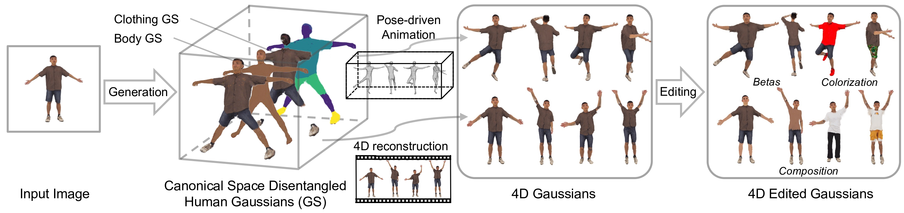

<div align="center">

# Disco4D: Disentangled 4D Human Generation and Animation from a Single Image

<div>
    <a href='' target='_blank'>Hui En Pang</a>&emsp;
    <a href='' target='_blank'>Shuai Liu</a>&emsp;
    <a href='https://caizhongang.github.io/' target='_blank'>Zhongang Cai</a>&emsp;
    <a href='https://yanglei.me/' target='_blank'>Lei Yang</a>&emsp;
    <a href='https://scholar.google.com/citations?user=9vpiYDIAAAAJ&hl=en' target='_blank'>Tianwei Zhang</a>&emsp;
    <a href='https://liuziwei7.github.io/' target='_blank'>Ziwei Liu</a>
</div>
<div>
    S-Lab, Nanyang Technological University
</div>

<strong><a href='https://cvpr.thecvf.com/Conferences/2025' target='_blank'>CVPR 2025</a></strong>

<h4 align="center">
  <a href="https://arxiv.org/abs/2409.17280" target='_blank'>[arXiv]</a> •
  <a href="https://disco-4d.github.io/" target='_blank'>[Project Page]</a> •
  <a href="hhttps://www.youtube.com/watch?v=iY09MlwNDeg" target='_blank'>[Video]</a> •
  <a href="" target='_blank'>[Slides]</a>
</h4>

## Getting started
### [Installation](#installation) | [Train](#train) | [Evaluation](#evaluation)


</div>

## Introduction

This repo is official PyTorch implementation of Disco4D: Disentangled 4D Human Generation and Animation from a Single Image (CVPR2025). 


<p align="center">
    
</p>


## Installation 

Refer to [install.md](install.md)

## Train 

Prepare the dataset:
```bash
python lib/dataset/process_4ddress.py
```

Image-to-3D:

```bash
### Generate avatar from image
sh run_img_synthesis.sh 
# ### Animate avatar
sh run_animate.sh 
# ### Edit avatar
sh run_edit.sh 
```


Video-to-4D:

```bash
### Generate avatar from 4D-Dress clips
sh run_video_synthesis.sh 
```

## Acknowledgement

This work is built on many amazing research works and open-source projects, thanks a lot to all the authors for sharing!
- [splattingavatar](https://github.com/initialneil/SplattingAvatar)
- [gaussian-grouping](https://github.com/lkeab/gaussian-grouping)
- [dreamgaussian](https://github.com/dreamgaussian/dreamgaussian)
- [gaussian-splatting](https://github.com/graphdeco-inria/gaussian-splatting) and [diff-gaussian-rasterization](https://github.com/graphdeco-inria/diff-gaussian-rasterization)
- [threestudio](https://github.com/threestudio-project/threestudio)
- [nvdiffrast](https://github.com/NVlabs/nvdiffrast)
- [dearpygui](https://github.com/hoffstadt/DearPyGui)


## Citation
If you find our work useful for your research, please consider citing the paper:
```
@inproceedings{
  title={Disco4D: Disentangled 4D Human Generation and Animation from a Single Image},
  author={Pang, Hui En and Liu, Shuai and Cai, Zhongang and Yang, Lei and Zhang, Tianwei and Liu, Ziwei},
  booktitle={CVPR},
  year={2025}
}
```

## License

Distributed under the S-Lab License. See `LICENSE` for more information.

## Acknowledgements

This research/project is supported by the National Research Foundation, Singapore under its AI Singapore Programme. This study is also supported by the Ministry of Education, Singapore, under its MOE AcRF Tier 2 (MOE-T2EP20221-0012), NTU NAP, and under the RIE2020 Industry Alignment Fund – Industry Collaboration Projects (IAF-ICP) Funding Initiative, as well as cash and in-kind contribution from the industry partner(s). We sincerely thank the anonymous reviewers for their valuable comments on this paper.